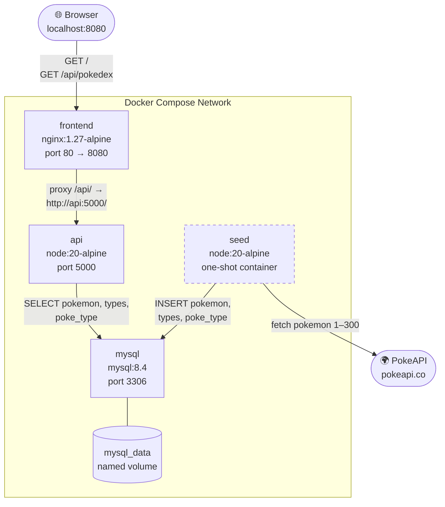
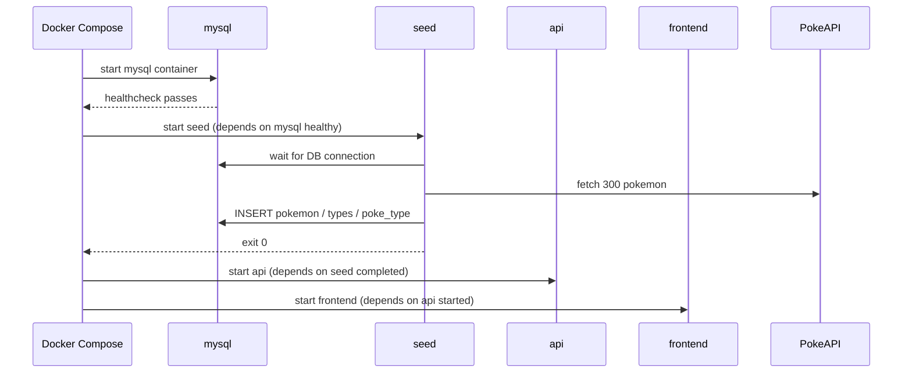
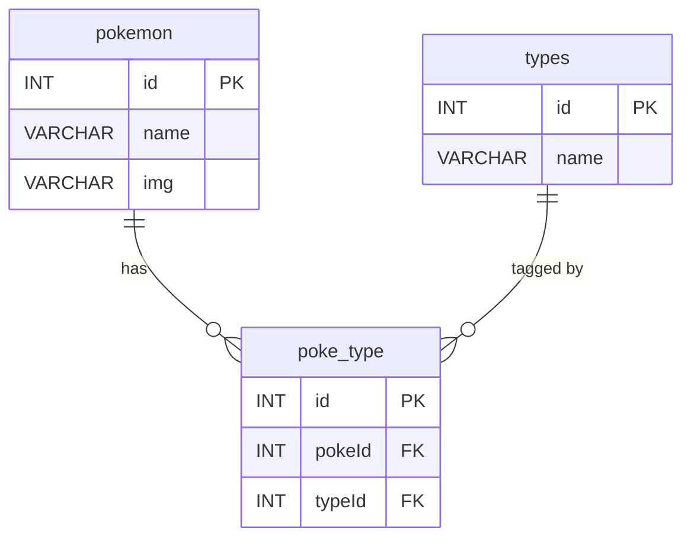

# About Pokedex Full Stack App

A full stack Pokedex application that fetches Pokemon data from the [PokeAPI](https://pokeapi.co/) and displays it in a browser. The app runs entirely with Docker Compose — one command starts the database, seeds it with data, serves the API, and hosts the frontend.

---

## Tech Stack

| Layer | Technology |
|---|---|
| Frontend | HTML, CSS, JavaScript (nginx static server) |
| API | Node.js, Express |
| Database | MySQL 8.4 |
| Container runtime | Docker Compose |
| External data source | PokeAPI |

---

## Infrastructure Design



> The `seed` service (dashed) is a one-shot container. It runs after MySQL is healthy, loads data from PokeAPI, then exits. On subsequent startups it skips if the `pokemon` table already has rows.

---

## Startup Sequence



---

## Data Model



---

## API

| Method | Path | Response |
|---|---|---|
| GET | `/pokedex` | `{ id, name, type, img }[]` |

---

## Running the App

```bash
# First run (builds images, seeds DB automatically)
docker compose up --build

# Subsequent runs
docker compose up

# Manual reseed
docker compose exec api npm run db:reseed

# Full reset (wipes DB volume)
docker compose down -v && docker compose up --build
```

---

## Environment Variables

Defaults are defined in `.env.example`. Copy to `.env` to override:

| Variable | Default | Description |
|---|---|---|
| `MYSQL_ROOT_PASSWORD` | `rootpassword` | MySQL root password |
| `MYSQL_DATABASE` | `pokedex` | Database name |
| `MYSQL_USER` | `pokedex_user` | App DB user |
| `MYSQL_PASSWORD` | `pokedex_password` | App DB password |
| `POKEDEX_POKEMON_LIMIT` | `300` | Number of Pokemon to seed |
