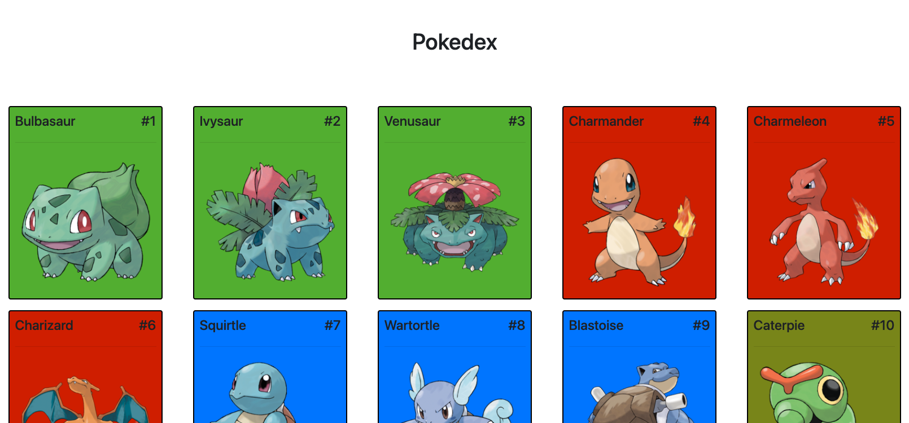

# Pokedex Full Stack App


This project runs a full Pokedex stack with Docker Compose:

- `mysql` for persistent database storage
- `api` (Express + MySQL driver)
- `frontend` (nginx serving static web files)

On first startup, schema is created automatically and Pokemon data is seeded from PokeAPI.

## Quick Start (Docker Compose)

1. Optional: copy environment defaults.

```bash
cp .env.example .env
```

2. Start the full stack.

```bash
docker compose up --build
```

3. Open the app.

- Frontend: http://localhost:8080
- API: http://localhost:5000/pokedex
- MySQL: localhost:3306

## Database Initialization and Seed Behavior

- Schema initialization runs from `data/schema.sql` using MySQL's init hook.
- The `seed` service runs `npm run seed:if-empty`.
- If `pokemon` already has rows, seed is skipped.
- If the MySQL volume is fresh, all initial data is loaded.

## Manual Database Reseed

Run reseed inside the API container:

```bash
docker compose exec api npm run db:reseed
```

Or run only seed (without reset):

```bash
docker compose exec api npm run seed
```

## Full Reset (including MySQL data)

```bash
docker compose down -v
docker compose up --build
```

`-v` deletes the named MySQL volume, so the next startup performs first-run initialization again.

## Environment Variables

Use `.env` (optional) to override defaults:

- `MYSQL_ROOT_PASSWORD`
- `MYSQL_DATABASE`
- `MYSQL_USER`
- `MYSQL_PASSWORD`
- `POKEDEX_POKEMON_LIMIT`

## Local (Non-Docker) Notes

- Frontend API base URL is configured in `web/config.js`.
- Default is `http://localhost:5000`.
- For Docker frontend image, a container-specific config points to `/api` via nginx proxy.

## Requirements
* The user can view all the pokemon. 
* The user can view a picture of each pokemon.
* The user can view the pokemon name and number.
* The system will change the color of the card based on the Pokemons type. For example, yellow for electric.
* The system will initially fill the database with data from the PokeAPI

### Optional
* The user can search pokemon
* The user can view more attributes of each pokemon 
* The user can order pokemon by any attribute
* The user can filter pokemon by any attribute

## Mockup


## Model
|Pokemon|
| - |
| id: number |
| name: string |
| img: string |
| types: string[] |

## Service Contract
|Method|Path|Response
|-|-|-|
| GET | /pokemons | Pokemon[] |

## External Services
[PokeAPI](https://pokeapi.co/)
